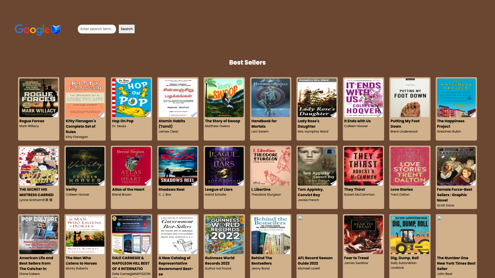

# Google Books API Search Engine

 

  

 
<b>Live deployment:</b> 
https://stellular-baklava-426ffb.netlify.app/
 

## Outline

This project uses both REACT and Asynchronous programming.
The user is able to search for a book inside the Google Books database and is then able to get more details about a certain title.

## MVP

The project contains the following:

-    Header section introducing the page
-    Form containing a text input and a submit / search button

-    A grid of books

-    When the submit button is clicked a request is made to the Google books API using the input value as a query string
-    The books received are rendered in the books grid.
-    Each book in the grid has an image, author, title and description
-    The grid is responsive on different screen sizes
-    Uses async / await for your request code, NOT .then

-    When a user clicks a book in the grid, a modal appears with more book information.
